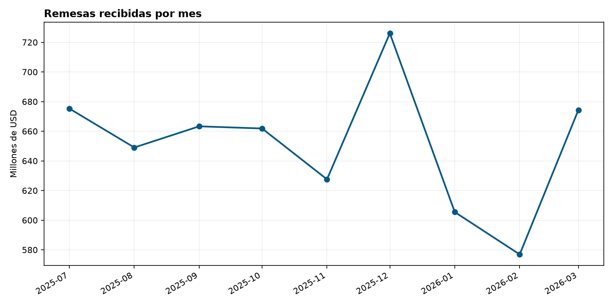
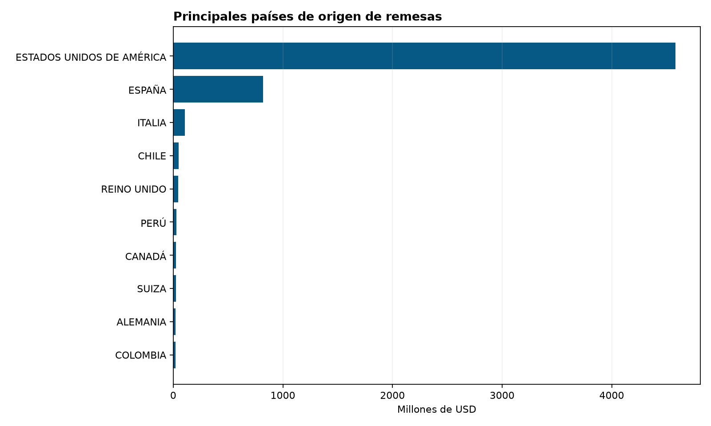
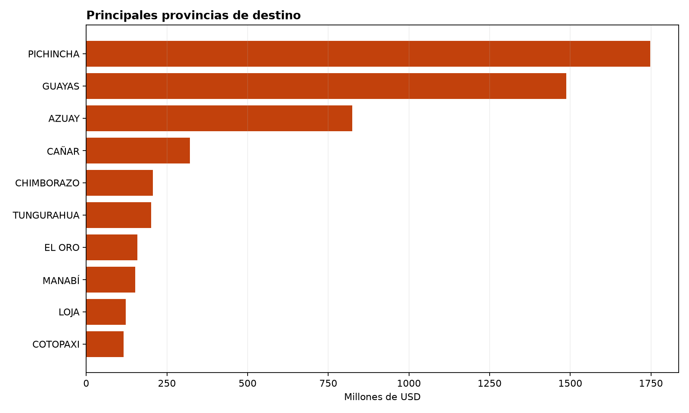

# Informe descriptivo: remesas recibidas en Ecuador

**Fuente:** Base de Datos de Remesas de Trabajadores del Banco Central del Ecuador (BCE).

**Periodo cubierto:** julio de 2025 a marzo de 2026.

**Total registrado:** USD 5,859,899,405.65.

Este informe agrega registros mensuales por país de origen y provincia de destino.
Describe los datos publicados; no establece relaciones causales con migración,
pobreza, empleo u otras variables.

## Evolución mensual

| fecha | remesas_usd | variacion_mensual_pct |
| --- | --- | --- |
| 2025-07 | USD 675,309,384.22 | — |
| 2025-08 | USD 649,039,982.21 | -3.89% |
| 2025-09 | USD 663,313,845.44 | 2.20% |
| 2025-10 | USD 661,870,622.31 | -0.22% |
| 2025-11 | USD 627,571,485.56 | -5.18% |
| 2025-12 | USD 726,078,802.25 | 15.70% |
| 2026-01 | USD 605,478,772.54 | -16.61% |
| 2026-02 | USD 576,922,809.82 | -4.72% |
| 2026-03 | USD 674,313,701.30 | 16.88% |

## Diez principales países de origen

| pais_origen | remesas_usd |
| --- | --- |
| ESTADOS UNIDOS DE AMÉRICA | USD 4,579,398,409.38 |
| ESPAÑA | USD 819,417,054.38 |
| ITALIA | USD 106,420,381.66 |
| CHILE | USD 50,798,410.48 |
| REINO UNIDO | USD 44,806,683.95 |
| PERÚ | USD 30,232,491.58 |
| CANADÁ | USD 25,205,955.85 |
| SUIZA | USD 25,094,223.59 |
| ALEMANIA | USD 21,150,755.94 |
| COLOMBIA | USD 19,884,943.45 |

## Diez principales provincias de destino

| provincia_destino | remesas_usd |
| --- | --- |
| PICHINCHA | USD 1,748,514,236.10 |
| GUAYAS | USD 1,486,982,687.33 |
| AZUAY | USD 824,705,295.09 |
| CAÑAR | USD 321,295,061.05 |
| CHIMBORAZO | USD 206,842,593.79 |
| TUNGURAHUA | USD 201,584,709.58 |
| EL ORO | USD 158,330,904.15 |
| MANABÍ | USD 151,469,077.24 |
| LOJA | USD 123,028,289.21 |
| COTOPAXI | USD 115,111,169.15 |

## Gráficos

